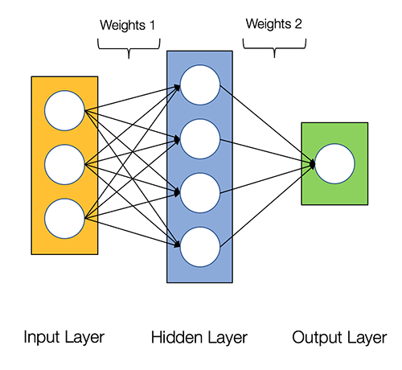
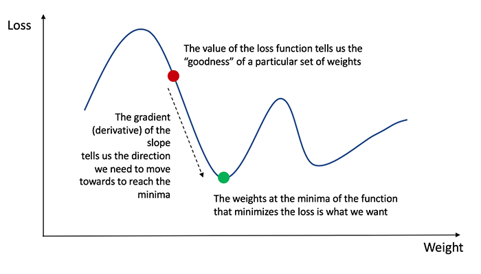
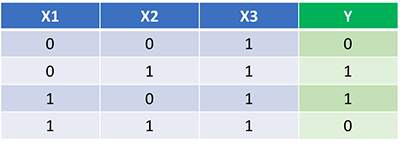
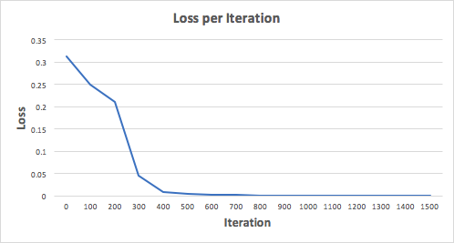
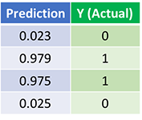

# 从零构建深度神经网络

**动机**：为了更加深入的理解深度学习，我们将使用Python语言从头搭建一个神经网络，而不是使用像Tensorflow那样的封装好的框架。我认为理解神经网络的内部工作原理，对数据科学家来说至关重要。

这篇文章的内容是我的所学，希望也能对你有所帮助。

## 神经网络是什么

介绍神经网络的文章大多数都会将它和大脑进行类比。如果你没有深入研究过大脑与神经网络的类比，那么将神经网络解释为一种将给定输入映射为期望输出的数学关系会更容易理解。

神经网络包括以下组成部分：

- 一个输入层，$x$
- 任意数量的隐藏层
- 一个输出层，$\hat{y}$
- 每层之间有一组权值和偏置，$W \ and \ b$
- 为隐藏层选择一种激活函数，$\sigma$。在教程中我们使用Sigmoid激活函数。

下图展示了2层神经网络的结构（注意：我们在计算网络层数时通常排除输入层）



用Python可以很容易的构建神经网络类

```py
class NeuralNetwork:
    def __init__(self, x, y):
        self.input      = x
        self.weights1   = np.random.rand(self.input.shape[1],4)
        self.weights2   = np.random.rand(4,1)
        self.y          = y
        self.output     = np.zeros(y.shape)
```

### 训练神经网络

这个网络的输出$\hat{y}$为：

$$
\hat{y} = \sigma (W_2 \sigma (W_1 x + b_1) + b_2)
$$

你可能会注意到，在上面的等式中，输出$\hat{y}$是$W$和$b$函数。

因此$W$和$b$的值影响预测的准确率. 所以根据输入数据对$W$和$b$调优的过程就被成为训练神经网络。

每步训练迭代包含以下两个部分:

- 计算预测结果$\hat{y}$，这一步称为**前向传播**。
- 更新$W$和$b$，这一步称为**反向传播**。

下面的顺序图展示了这个过程：


### 前向传播

正如我们在上图中看到的，前向传播只是简单的计算。对于一个基本的2层网络来说，它的输出是这样的：

$$
\hat{y} = \sigma (W_2 \sigma (W_1 x + b_1) + b_2)
$$

我们在NeuralNetwork类中增加一个计算前向传播的函数。为了简单起见我们假设偏置$b$为$0$：

```py
class NeuralNetwork:
    def __init__(self, x, y):
        self.input      = x
        self.weights1   = np.random.rand(self.input.shape[1],4)
        self.weights2   = np.random.rand(4,1)
        self.y          = y
        self.output     = np.zeros(self.y.shape)

    def feedforward(self):
        self.layer1 = sigmoid(np.dot(self.input, self.weights1))
        self.output = sigmoid(np.dot(self.layer1, self.weights2))
```

但是我们还需要一个方法来评估预测结果的好坏（即预测值和真实值的误差）。这就要用到损失函数。

### 损失函数

常用的损失函数有很多种，根据模型的需求来选择。在本教程中，我们使用误差平方和作为损失函数。

$$
Sum\text{--}of\text{--}Squares \ Error = \sum_{i=1}^{n}(y-\hat{y})^2.
$$

误差平方和是求每个预测值和真实值之间的误差再求和，这个误差是他们的差值求平方以便我们观察误差的绝对值。

训练的目标是找到一组$W$和$b$，使得损失函数最好小，也即预测值和真实值之间的距离最小。

### 反向传播

我们已经度量出了预测的误差（损失），现在需要找到一种方法来传播误差，并以此更新权值和偏置。

为了知道如何适当的调整权值和偏置，我们需要知道损失函数对权值$W$和偏置$b$的导数。

回想微积分中的概念，函数的导数就是函数的斜率。



如果我们已经求出了导数，我们就可以通过增加或减少导数值来更新权值$W$和偏置$b$（参考上图）。这种方式被称为梯度下降法。

但是我们不能直接计算损失函数对权值和偏置的导数，因为在损失函数的等式中并没有显式的包含他们。因此，我们需要运用链式求导发在来帮助计算导数。

$$
Loss(y,\hat{y})=\sum_{i=1}^{n}(y-\hat{y})^2
$$

$$
\begin{aligned}
\frac{\partial Loss(y,\hat{y})}{\partial W} &=
\frac{\partial Loss(y,\hat{y})}{\partial \hat{y}} * \frac{\partial \hat{y}}{\partial z} * \frac{\partial z}{\partial W} \quad where \quad z = Wx + b \\
&= 2(y-\hat{y})*Sigmoid \text{函数的导数}*x \\
&= 2(y-\hat{y})*z(1-z)*x
\end{aligned}
$$

链式法则用于计算损失函数对$W$和$b$的导数。注意，为了简单起见。我们只展示了假设网络只有$1$层的偏导数。

这虽然很简陋，但是我们依然能得到想要的结果—损失函数对权值$W$的导数（斜率），因此我们可以相应的调整权值。

现在我们将反向传播算法的函数添加到Python代码中

```py
class NeuralNetwork:
    def __init__(self, x, y):
        self.input      = x
        self.weights1   = np.random.rand(self.input.shape[1],4)
        self.weights2   = np.random.rand(4,1)
        self.y          = y
        self.output     = np.zeros(self.y.shape)

    def feedforward(self):
        self.layer1 = sigmoid(np.dot(self.input, self.weights1))
        self.output = sigmoid(np.dot(self.layer1, self.weights2))

    def backprop(self):
        # application of the chain rule to find derivative of the loss function with respect to weights2 and weights1
        d_weights2 = np.dot(self.layer1.T, (2*(self.y - self.output) * sigmoid_derivative(self.output)))
        d_weights1 = np.dot(self.input.T,  (np.dot(2*(self.y - self.output) * sigmoid_derivative(self.output), self.weights2.T) * sigmoid_derivative(self.layer1)))

        # update the weights with the derivative (slope) of the loss function
        # 利用求得的梯度更新权值，所以叫梯度下降
        self.weights1 += d_weights1
        self.weights2 += d_weights2
```

## 整合并完成一个实例

既然我们已经有了包括前向传播和反向传播的完整Python代码，那么就将其应用到一个例子上看看它是如何工作的吧。



神经网络可以通过学习得到函数的权重。而我们仅靠观察是不太可能得到函数的权重的。

让我们训练神经网络进行1500次迭代，看看会发生什么。 注意观察下面每次迭代的损失函数，我们可以清楚地看到损失函数单调递减到最小值。这与我们之前介绍的梯度下降法一致。



让我们看看经过1500次迭代后的神经网络的最终预测结果：



经过1500次迭代训练后的预测结果

我们成功了！我们应用前向和方向传播算法成功的训练了神经网络并且预测结果收敛于真实值。

注意预测值和真实值之间存在细微的误差是允许的。这样可以防止模型过拟合并且使得神经网络对于未知数据有着更强的泛化能力。

## 下一步是什么

幸运的是我们的学习之旅还没有结束，仍然有很多关于神经网络和深度学习的内容需要学习。例如：

- 除了Sigmoid以外，还可以用哪些激活函数
- 在训练网络的时候应用学习率
- 在面对图像分类任务的时候使用卷积神经网络

我很快会写更多关于这个主题的内容，敬请期待！

## 最后的想法

我自己也从零开始写了很多神经网络的代码。

虽然可以使用诸如Tensorflow和Keras这样的深度学习框架方便的搭建深层网络而不需要完全理解其内部工作原理。但是我觉得对于有追求的数据科学家来说，理解内部原理是非常有益的。

这种练习对我自己来说已成成为重要的时间投入，希望也能对你有所帮助。

## 推导笔记

这里要注意的一点是，程序中将偏置$b$设置为了$0$。所以预测结果为：

$$
\hat{y} = \sigma (W_2 \sigma(W_1 X)) \\
layer1 = \sigma(W_1 X) \\
output = \sigma(W_2 layer1)
$$

用到的矩阵求导的一个公式如下，假设$A$和$B$都是矩阵，则

$$
\frac{\partial AB}{A} = B^T
$$
