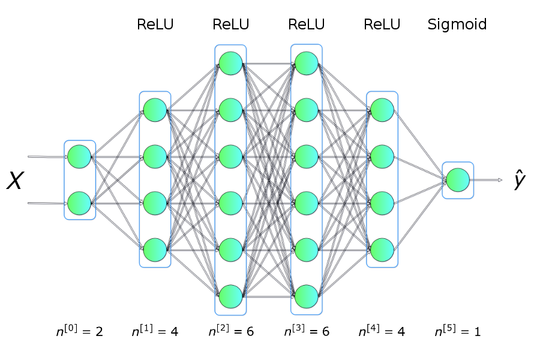
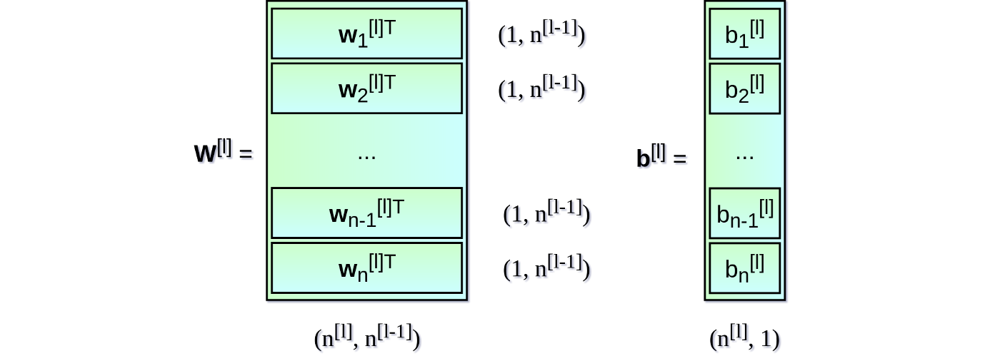

# 使用NumPy实现一个复杂的深度神经网络

## 导言

在正式开始之前，需要先对所做实验进行构思。我们想要编写一个程序，使其能够创建一个具有指定架构（层的数量、大小以及激活函数）的神经网络，如下图所示。总之，我们需要预先对网络进行训练，然后利用它进行预测。



## 神经网络层的初始化

首先，对每一层的权重矩阵$W$及偏置向量$b$进行初始化。在下图中，上标$[l]$表示目前是第几层（从$1$开始），$n$的值表示一层中的神经元数量。描述神经网络架构的信息类似于下面的代码片段中所列内容。每一项都描述了单层神经网络的基本参数：input\_dim，即输入层神经元维度；output\_dim，即输出层神经元维度；activation，即使用的激活函数。



代码片段如下：

```py
nn_architecture = [
    {"input_dim": 2, "output_dim": 4, "activation": "relu"},
    {"input_dim": 4, "output_dim": 6, "activation": "relu"},
    {"input_dim": 6, "output_dim": 6, "activation": "relu"},
    {"input_dim": 6, "output_dim": 4, "activation": "relu"},
    {"input_dim": 4, "output_dim": 1, "activation": "sigmoid"},
]
```

从上面的代码片段中可以看出，每一层输出神经元的维度等于下一层的输入维度。对权重矩阵W及偏置向量b进行初始化的代码如下：

```py
def init_layers(nn_architecture, seed = 99):
    np.random.seed(seed)
    number_of_layers = len(nn_architecture)
    params_values = {}

    for idx, layer in enumerate(nn_architecture):
        layer_idx = idx + 1
        layer_input_size = layer["input_dim"]
        layer_output_size = layer["output_dim"]

        params_values['W' + str(layer_idx)] = np.random.randn(
            layer_output_size, layer_input_size) * 0.1
        params_values['b' + str(layer_idx)] = np.random.randn(
            layer_output_size, 1) * 0.1

    return params_values
```

在本节中，我们利用NumPy将权重矩阵$W$及偏置向量$b$初始化为小的随机数。特别注意的是，初始化权重值不能相同，否则网络会变为对称的。也就是说，如果权重初始化为同一值，则对于任何输入$X$，每个隐藏层对应的每个神经元的输出都是相同的，这样即使梯度下降训练，无论训练多少次，这些神经元都是对称的，无论隐藏层内有多少个结点，都相当于在训练同一个函数。

初始化的值较小能够使得算法第一次迭代的时候效率更高。

## 激活函数

激活函数在神经网络中至关重要，其原理简单但功能强大，给神经元引入了非线性因素，使得神经网络可以任意逼近任何非线性函数，从而应用于众多的非线性模型。“如果没有激活函数，每一层输出都是上层输入的线性函数，无论神经网络有多少层，输出都是输入的线性组合。”激活函数种类众多，本文选取了最常用的两种——ReLU及Sigmoid函数，代码如下：

```py
def sigmoid(Z):
    return 1/(1+np.exp(-Z))

def relu(Z):
    return np.maximum(0,Z)

def sigmoid_backward(dA, Z):
    sig = sigmoid(Z)
    return dA * sig * (1 - sig)

def relu_backward(dA, Z):
    dZ = np.array(dA, copy = True)
    dZ[Z <= 0] = 0
    return dZ
```

## 前向传播算法

本文所设计的神经网络结构简单，信息流只有一个方向：以$X$矩阵的形式传递，穿过所有隐藏层单元，最终输出预测结构$\hat{Y}$。

```py
def single_layer_forward_propagation(A_prev, W_curr, b_curr, activation="relu"):
    Z_curr = np.dot(W_curr, A_prev) + b_curr

    if activation is "relu":
        activation_func = relu
    elif activation is "sigmoid":
        activation_func = sigmoid
    else:
        raise Exception('Non-supported activation function')

    return activation_func(Z_curr), Z_curr
```

前向传播就是上层处理完的数据作为下一层的输入数据，然后进行处理(权重)，再传给下一层，这样逐层处理，最后输出。给定上一层的输入信号，计算仿射变换（affine transformation）Z，然后应用选定的激活函数。

前向传播算法代码如下，该函数不仅进行预测计算，还存储中间层A和Z矩阵的值：

```py
def full_forward_propagation(X, params_values, nn_architecture):
    memory = {}
    A_curr = X

    for idx, layer in enumerate(nn_architecture):
        layer_idx = idx + 1
        A_prev = A_curr

        activ_function_curr = layer["activation"]
        W_curr = params_values["W" + str(layer_idx)]
        b_curr = params_values["b" + str(layer_idx)]
        A_curr, Z_curr = single_layer_forward_propagation(A_prev, W_curr, b_curr, activ_function_curr)

        memory["A" + str(idx)] = A_prev
        memory["Z" + str(layer_idx)] = Z_curr

    return A_curr, memory
```

## 损失函数

损失函数是用来估量模型的预测值与真实值的不一致程度，它是一个非负实值函数。损失函数由我们想要解决的问题所决定。在本文中，我们想要测试神经网络模型区分两个类别的能力，所以选择了交叉熵损失函数，其定义如下：

$$
\begin{aligned}
    J(W, b) = \frac{1}{m}\sum_{i=1}^m L(\hat{y}^{(i)},y^{(i)}) \\
    L(\hat{y},y)=-(y\log \hat{y} + (1-y)\log(1-\hat{y}))
\end{aligned}
$$

为了更加清楚的了解学习过程，我增添了一个用于计算精度的函数：

```py
def get_cost_value(Y_hat, Y):
    m = Y_hat.shape[1]
    cost = -1 / m * (np.dot(Y, np.log(Y_hat).T) + np.dot(1 - Y, np.log(1 - Y_hat).T))
    return np.squeeze(cost)

def get_accuracy_value(Y_hat, Y):
    Y_hat_ = convert_prob_into_class(Y_hat)
    return (Y_hat_ == Y).all(axis=0).mean()
```

## 反向传播算法

许多缺乏经验的深度学习爱好者认为反向传播是一种复杂且难以理解的算法。

```py
def single_layer_backward_propagation(dA_curr, W_curr, b_curr, Z_curr, A_prev, activation="relu"):
    m = A_prev.shape[1]

    if activation is "relu":
        backward_activation_func = relu_backward
    elif activation is "sigmoid":
        backward_activation_func = sigmoid_backward
    else:
        raise Exception('不支持的激活函数')

    dZ_curr = backward_activation_func(dA_curr, Z_curr)
    dW_curr = np.dot(dZ_curr, A_prev.T) / m
    db_curr = np.sum(dZ_curr, axis=1, keepdims=True) / m
    dA_prev = np.dot(W_curr.T, dZ_curr)

    return dA_prev, dW_curr, db_curr
```

其实，他们困惑的也就是反向传播算法中的梯度下降问题，但二者并不可混为一谈。前者旨在有效地计算梯度，而后者是利用计算得到的梯度进行优化。梯度下降可以应对带有明确求导函数的情况，我们可以把它看作没有隐藏层的网络；但对于多隐藏层的神经网络，应先将误差反向传播至隐藏层，然后再应用梯度下降，其中将误差从最末层往前传递的过程需要链式法则，反向传播算法可以说是梯度下降在链式法则中的应用。对于单层的神经网络，该过程如下所示：

$$
\begin{aligned}
    \mathbf{dW}^{[l]} = \frac{\partial L}{\partial \mathbf{W}^{[l]}} = \frac{1}{m}\mathbf{dZ}^{[l]}\mathbf{A}^{[l-1]T} \\
    \mathbf{db}^{[l]} = \frac{\partial L}{\partial \mathbf{b}^{[l]}} = \frac{1}{m}\sum_{i=1}^m\mathbf{dZ}^{[l](i)} \\
    \mathbf{dA}^{[l-1]}=\frac{\partial L}{\partial \mathbf{A}^{[l]}} * g'(\mathbf(Z)^{[l]})
\end{aligned}
$$

本文省略推导过程，但从上面的公式仍可看出$A$和$Z$矩阵值的重要性。

上面的代码中所示代码仅编写了神经网络中某层的反向传播算法，下面的代码将展示神经网络中完整的反向传播算法。

```py
def full_backward_propagation(Y_hat, Y, memory, params_values, nn_architecture):
    grads_values = {}
    m = Y.shape[1]
    Y = Y.reshape(Y_hat.shape)

    dA_prev = - (np.divide(Y, Y_hat) - np.divide(1 - Y, 1 - Y_hat));

    for layer_idx_prev, layer in reversed(list(enumerate(nn_architecture))):
        layer_idx_curr = layer_idx_prev + 1
        activ_function_curr = layer["activation"]

        dA_curr = dA_prev

        A_prev = memory["A" + str(layer_idx_prev)]
        Z_curr = memory["Z" + str(layer_idx_curr)]
        W_curr = params_values["W" + str(layer_idx_curr)]
        b_curr = params_values["b" + str(layer_idx_curr)]

        dA_prev, dW_curr, db_curr = single_layer_backward_propagation(
            dA_curr, W_curr, b_curr, Z_curr, A_prev, activ_function_curr)

        grads_values["dW" + str(layer_idx_curr)] = dW_curr
        grads_values["db" + str(layer_idx_curr)] = db_curr

    return grads_values
```

## 参数更新

该部分旨在利用计算得到梯度更新网络中的参数，同时最小化目标函数。我们会使用到params\_values，它存放当前的参数值，以及grads\_values，它存放存储关于这些参数的损失函数的导数。现在只需要在神经网络的每层应用如下公式即可：

$$
\begin{aligned}
\mathbf{W}^{[l]} = \mathbf{W}^{[l]} - \alpha\mathbf{dW}^{[l]} \\
\mathbf{b}^{[l]} = \mathbf{b}^{[l]} - \alpha\mathbf{db}^{[l]}
\end{aligned}
$$

代码片段如下：

```py
def update(params_values, grads_values, nn_architecture, learning_rate):
    for layer_idx, layer in enumerate(nn_architecture):
        params_values["W" + str(layer_idx)] -= learning_rate * grads_values["dW" + str(layer_idx)]
        params_values["b" + str(layer_idx)] -= learning_rate * grads_values["db" + str(layer_idx)]

    return params_values
```

## 整合

现在我们只需将准备好的函数按照正确的顺序整合到一起，若对正确的顺序有疑问请参见图2。

```py
def train(X, Y, nn_architecture, epochs, learning_rate):
    params_values = init_layers(nn_architecture, 2)
    cost_history = []
    accuracy_history = []

    for i in range(epochs):
        Y_hat, cashe = full_forward_propagation(X, params_values, nn_architecture)
        cost = get_cost_value(Y_hat, Y)
        cost_history.append(cost)
        accuracy = get_accuracy_value(Y_hat, Y)
        accuracy_history.append(accuracy)

        grads_values = full_backward_propagation(Y_hat, Y, cashe, params_values, nn_architecture)
        params_values = update(params_values, grads_values, nn_architecture, learning_rate)

    return params_values, cost_history, accuracy_history
```

## 对比分析

接下来，我们将利用所构建的模型解决简单的分类问题。如图7所示，本次实验使用的数据集包含两个类别。我们将训练模型对两个不同的类别进行区分。此外，我们还准备了一个由Keras所构建的神经网络模型以进行对比。两个模型具有相同的架构和学习速率。虽然我们的模型很简单，但结果表明，NumPy和Keras模型在测试集上均达到了95\%的准确率。只是我们的模型耗费了更多的时间，未来工作可通过加强优化改善时间开销问题。
